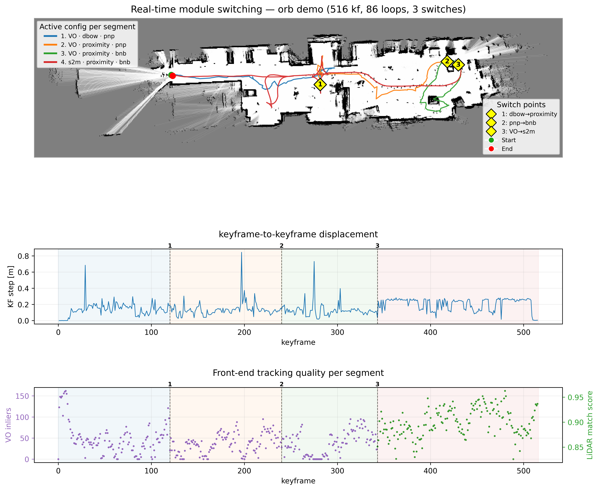

# Modular SLAM Framework

This repository contains a modular SLAM framework for experimenting with
different SLAM layer combinations. The fusion layer lets you choose modules for
tracking, loop proposal, and loop verification while all modes write into the
same shared SE(2) map.



## Main Idea

```text
Front End -> Loop Proposer -> Loop Verifier -> Shared SE(2) Map
```

The fusion2 implementation is under:

```text
slam_core/fusion2/
```

Main folders:

| Folder | Purpose |
|---|---|
| `Front_End/` | LiDAR and visual odometry front ends |
| `Loop_Proposer/` | Loop candidate proposal modules |
| `Loop_Verifier/` | Loop verification modules |
| `Dependencies/` | Dataset, ROS, pose, visual feature, and output helpers |
| `backend.py` | Shared map construction |
| `runner.py` | Batch runner |
| `run_realtime.py` | Real-time switching runner |
| `config.py` | Fusion configuration |

## Setup

Create your own Python environment. The repository does not include a virtual
environment.

Example:

```bash
python3 -m venv .venv
source .venv/bin/activate
python -m pip install -r requirements.lock.txt
```

Depending on your platform, you may also need to build the native C++ extensions
used by the SLAM back end.

Run commands from the repository root:

```bash
cd <path-to-this-repository>
```

If you do not use a virtual environment, replace `python` with the Python
interpreter configured for your system.

## Dataset

Datasets are not included in this repository. Provide your own dataset directory
and pass it with `--dataset`.

Example layout expected by the current Lab/RGB-D loader:

```text
your_dataset/
  sensor_config.yaml
  associations_rgbd.txt
  imu.csv
  lidar/
    scans.csv
```

Use any dataset path that matches your loader/configuration:

```bash
--dataset <path-to-dataset>
```

## Batch Runner

The batch runner executes one fixed SLAM configuration from start to finish:

```bash
python -m slam_core.fusion2.runner \
  --dataset <path-to-dataset> \
  --mode lidar \
  --lidar-frontend native_s2s \
  --verifier bnb \
  --output <output-directory>
```

Show all runner options:

```bash
python -m slam_core.fusion2.runner --help
```

## Available Modes

| Mode | Tracking Front End | Loop Proposer | Loop Verifier |
|---|---|---|---|
| `lidar` | LiDAR | Proximity | B&B or ICP on LiDAR scans |
| `orb` | Visual VO / ORB | DBoW | PnP on visual features |
| `orb_lidar` | Visual VO / ORB | DBoW | B&B or ICP on synced LiDAR scans |
| `lidar_orb` | LiDAR | Proximity | PnP on synced visual features |

## Module Options

### Front End

LiDAR front-end options:

| Option | Description |
|---|---|
| `native_s2s` | Native C++ scan-to-submap front end |
| `native_s2m` | Native C++ scan-to-map front end |
| `legacy_s2s` | Python scan-to-submap front end |
| `legacy_s2m` | Python scan-to-map front end |

Visual front-end options:

| Option | Description |
|---|---|
| `native` | Native C++ RGB-D visual odometry |
| `legacy` | Legacy Python ORB-SLAM based front end |

### Loop Proposer

| Proposer | Description |
|---|---|
| `proximity` | Proposes nearby graph poses and can retrieve old places from long-term memory |
| `dbow` | Proposes visually similar places using ORB descriptors |

The batch runner chooses the proposer from the selected mode.

### Loop Verifier

| Verifier | Description |
|---|---|
| `bnb` | Branch-and-bound scan verification |
| `icp` | ICP/GICP scan verification |
| `pnp` | Visual feature matching with PnP RANSAC |

Use `--verifier bnb` or `--verifier icp` for scan-verified modes:

```bash
--verifier bnb
```

`pnp` is selected automatically by visual-verified modes.

## Example Commands

LiDAR-only SLAM:

```bash
python -m slam_core.fusion2.runner \
  --dataset <path-to-dataset> \
  --mode lidar \
  --lidar-frontend native_s2s \
  --verifier bnb \
  --output <output-directory>
```

Visual-only SLAM:

```bash
python -m slam_core.fusion2.runner \
  --dataset <path-to-dataset> \
  --mode orb \
  --frontend native \
  --output <output-directory>
```

Visual-led SLAM with LiDAR scan verification:

```bash
python -m slam_core.fusion2.runner \
  --dataset <path-to-dataset> \
  --mode orb_lidar \
  --frontend native \
  --verifier bnb \
  --output <output-directory>
```

LiDAR-led SLAM with visual verification:

```bash
python -m slam_core.fusion2.runner \
  --dataset <path-to-dataset> \
  --mode lidar_orb \
  --lidar-frontend native_s2s \
  --output <output-directory>
```

## Real-Time Runner

The real-time runner supports live module switching while keeping the same shared
map active:

```bash
python -m slam_core.fusion2.run_realtime \
  --dataset <path-to-dataset> \
  --mode lidar \
  --lidar-frontend native_s2s \
  --verifier bnb \
  --proposer proximity \
  --output <output-directory>
```

Live commands:

```text
verifier bnb
verifier icp
verifier pnp
proposer proximity
proposer dbow
fe s2s
fe s2m
fe vo
status
quit
```

Notes:

- `pnp` and `dbow` require visual descriptors.
- LiDAR keyframes carry visual descriptors only when enabled by the selected mode
  or runtime options.
- Visual front-end keyframes always carry visual descriptors.

## Outputs

Runs write results to the selected output directory.

Typical files:

| File | Description |
|---|---|
| `trajectory.tum` | Optimized trajectory in TUM format |
| `occupancy.png` | Rendered fused occupancy map |
| `map.npy` | Occupancy probability grid |
| `map_meta.json` | Map origin, resolution, size, and extent |
| `scan_overlay.png` | Raw scan overlay debug figure |
| `run_summary.json` | Run statistics |
| `verifications.csv` | Loop proposal and verification log |

Generated outputs are ignored by git.

## Configuration

Fusion parameters:

```text
slam_core/fusion2/config.py
```

LiDAR matcher profiles:

```text
hector/config.py
```

More implementation details:

```text
slam_core/fusion2/README.md
```
